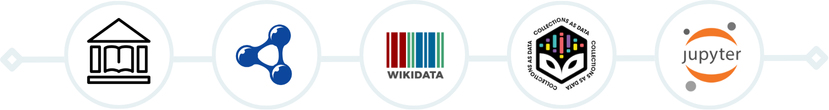

# Creating Collections as Data Using Federated Queries



This repository provides a series of **Jupyter notebooks** designed for performing **federated queries** across **Wikidata** and other **linked open data (LOD)** endpoints, with a focus on querying bibliographic and author-related data. 

These notebooks support our paper *From Linked Open Data to Collections as Data: 
A Reproducible Framework Using Federated Queries* and aim to present reproducible examples of query design strategies other than structured real-world use in library and information studies, digital humanities and other domains.

[](https://mybinder.org/v2/gh/semanticnoodles/federated-cad/HEAD)

## How to Cite This Work
We recommend you to cite the paper the notebooks are supporting, as well as the repository as a whole. The citation for the paper is:

> Meltem Dişli, Giulia Osti, Richard L. Zijdeman, & Gustavo Candela. (2025). From Linked Open Data to Collections as Data: A Reproducible Framework Using Federated Queries. *Journal*, Volume(Issue), Page range. DOI

While the citation for the repository is available in the [CITATION.cff](CITATION.cff) file. You can also use the following BibTeX entry:

```bibtex
@misc{federated-cad,
author = {{Meltem Dişli} and {Giulia Osti} and {Richard L. Zijdeman} and {Gustavo Candela}},
doi = {10.5281/zenodo.XXXXXXX},
month = apr,
title = {{Federated LOD Queries as CaD - Notebooks}},
url = {https://github.com/hibernator11/federated-lod-queries},
year = {2025}
}  
```

## Materials in this Repository

The repository is organized into the following sections:

- **Query Building**:  
  - *4 examples* showcasing a query-building workflow for three different endpoints:
    - [Biblioteca Nacional de España (BNE) Query Building ](https://github.com/semanticnoodles/federated-cad/blob/main/notebooks/01-query-building/LOD-BNE-Federated-Query.ipynb)
    - [Bibliothèque nationale de France (BNF) Query Building](https://github.com/semanticnoodles/federated-cad/blob/main/notebooks/01-query-building/LOD-BNF-Federated-Query.ipynb)
    - [Biblioteca Virtual Miguel de Cervantes (BVMC) Query Building](https://github.com/semanticnoodles/federated-cad/blob/main/notebooks/01-query-building/LOD-BVMC-Federated-Query.ipynb)
    - [Wikidata_map_viz](https://github.com/semanticnoodles/federated-cad/blob/main/notebooks/01-query-building/wikidata-map-viz.md), an exploratory query visualizing authors' places of birth from the Spanish Golden Age (wd:Q530936).

- **Single Author, Multiple Works**:  
  - *2 examples* focusing on retrieving multiple works by a single author:
    - [Jorge Juan y Santacilia](https://github.com/semanticnoodles/federated-cad/blob/main/notebooks/02-single-author/LOD-JorgeJuan-Federated-CAD.ipynb)
    - [Maria Zayas y Sotomayor](https://github.com/semanticnoodles/federated-cad/blob/main/notebooks/02-single-author/LOD-MariaZayas-Federated-CAD.ipynb)

- **Multiple Authors, Multiple Works**:  
  - *1 example* demonstrating queries involving multiple authors and their works, 
    - [Spanish Golden Age](https://github.com/semanticnoodles/federated-cad/blob/main/notebooks/03-movement-multiple-authors/LOD-SpanishGoldenAge-Federated-CAD.ipynb)
- 

## Running the Notebooks with Binder

This project includes example Jupyter notebooks that you can run directly in your browser using [Binder](https://mybinder.org/). Click the **Launch Binder** button below to start a live session:

[](https://mybinder.org/v2/gh/semanticnoodles/federated-cad/HEAD)

Once Binder finishes loading you will see a file browser on the left-hand side that will allow you to navigate all the notebooks contained in this repository.

### Tips for Using the Notebooks

-  To run all cells at once: click **“Cell” > “Run All”** from the top menu.
-  To step through cell-by-cell: use the ▶️ **Run** button at the top or next to each cell.
-  Feel free to **edit** code or markdown cells and re-run them — your changes are temporary and will not be saved once the session ends or times out (will not affect the repository structure).

## LOD Endpoints on Use

The SPARQL queries leverage data from the following endpoints:

- **Wikidata**: [https://query.wikidata.org/](https://query.wikidata.org/)
- **Biblioteca Nacional de España (BNE)**: [http://datos.bne.es/sparql](http://datos.bne.es/sparql)
- **Bibliothèque nationale de France (BNF)**: [https://data.bnf.fr/sparql](https://data.bnf.fr/sparql)
- **Biblioteca Virtual Miguel de Cervantes (BVMC)**: [https://data.cervantesvirtual.com/sparql](https://data.cervantesvirtual.com/sparql)

## License

[](http://creativecommons.org/licenses/by/4.0/)
Content is licensed under a [Creative Commons Attribution 4.0 International license](http://creativecommons.org/licenses/by/4.0/).

<!-- ## Essential References / add references to the paper, the notebooks, and any other relevant resources -->
